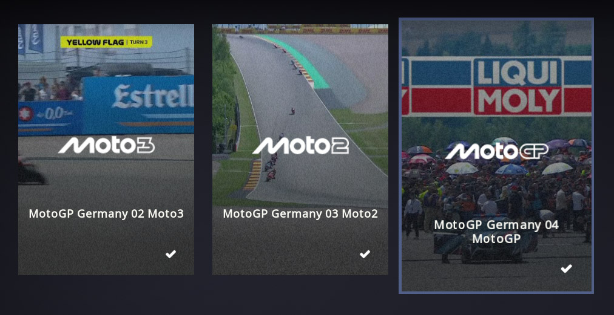

# kodi-fileposterview

This is for Estuary. It isn't perfect, but it will generate something similar to a poster with the file name for items that aren't in the library. This pairs well with [my sabnzbd event sorting pre-queue script](https://github.com/boringparty/sabnzbd-pq-ordering).



## Features

- Poster-first artwork (`poster.*`)
- Falls back to the video's thumbnail
- Overlay title for files without metadata
- Optimized for file mode (not library mode)

# Required changes

## 1. Copy

Copy `View_560_PosterFiles.xml` into the skin's `xml` directory.

## 2. Font.xml

Add to the **Default** fontset:

```xml
<font>
  <name>font8_poster</name>
  <filename>Roboto-Thin.ttf</filename>
  <size>16</size>
  <style>bold</style>
  <linespacing>0.85</linespacing>
</font>
```

## 3. strings.po

Add:

```po
#. viewtype name
msgctxt "#31990"
msgid "Poster Files"
msgstr "Poster Files"
```

## 4. MyVideoNav.xml

Add `560` to:

```xml
<views>50,51,52,53,54,55,500,501,502,560</views>
```

and include the new view:

```xml
<include>View_560_PosterFiles</include>
```
## 5. gradientNoise.png

Save this to /media/posterfiles

# Wishlist

- Remove text box from `back`
- Configurable number of posters per row
- Optional filename cleanup (strip extensions, years, etc.)
